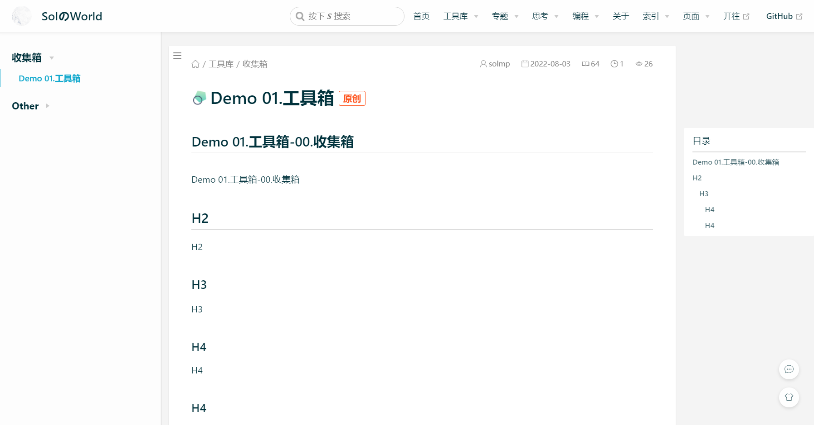

**Sol**
- 个人博客源代码仓库
- 静态博客，采用自动化部署

**博客地址：** [https://solmp.vercel.app/](https://solmp.vercel.app/)

**博客模板仓库：** [https://github.com/solmp/solmp-vdoing-blog-template](https://github.com/solmp/solmp-vdoing-blog-template)

# 页面展示

## 首页

## 文章页

